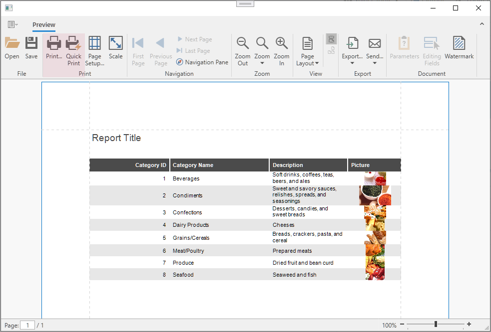

<!-- default badges list -->

<!-- default badges end -->
# Reporting for WPF - Override Print and PrintDirect (Quick Print) Commands in Document Preview

This example demonstrates how to override commands in [DocumentPreview](https://docs.devexpress.com/WPF/9697/controls-and-libraries/printing-exporting/concepts/document-preview). The technique is to create a descendant of [DocumentPreviewControl](https://docs.devexpress.com/WPF/DevExpress.Xpf.Printing.DocumentPreviewControl) and override its methods, in this example `Print` and `PrintDirect`.

## Files to Review

* [MainWindow.xaml](./CS/MinimalisticReportPreviewDemo/MainWindow.xaml) (VB: [MainWindow.xaml](./VB/MinimalisticReportPreviewDemo/MainWindow.xaml))
* **[MainWindow.xaml.cs](./CS/MinimalisticReportPreviewDemo/MainWindow.xaml.cs) (VB: [MainWindow.xaml.vb](./VB/MinimalisticReportPreviewDemo/MainWindow.xaml.vb))**
* [MyDocumentPreviewControl.cs](./CS/MinimalisticReportPreviewDemo/MyDocumentPreviewControl.cs) (VB: [MyDocumentPreviewControl.vb](./VB/MinimalisticReportPreviewDemo/MyDocumentPreviewControl.vb))

## Documentation

- [Override Document Preview Commands](https://docs.devexpress.com/XtraReports/115362/wpf-reporting/wpf-reporting-document-preview/api-and-customization/override-document-preview-commands)

## More Examples

- [DocumentPreviewControl - How to override the Export command](https://github.com/DevExpress-Examples/Reporting_documentpreviewcontrol-how-to-override-the-export-command-e4482)
